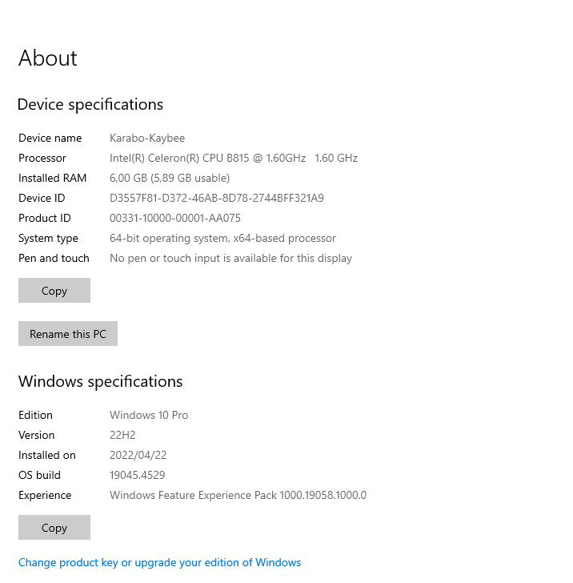
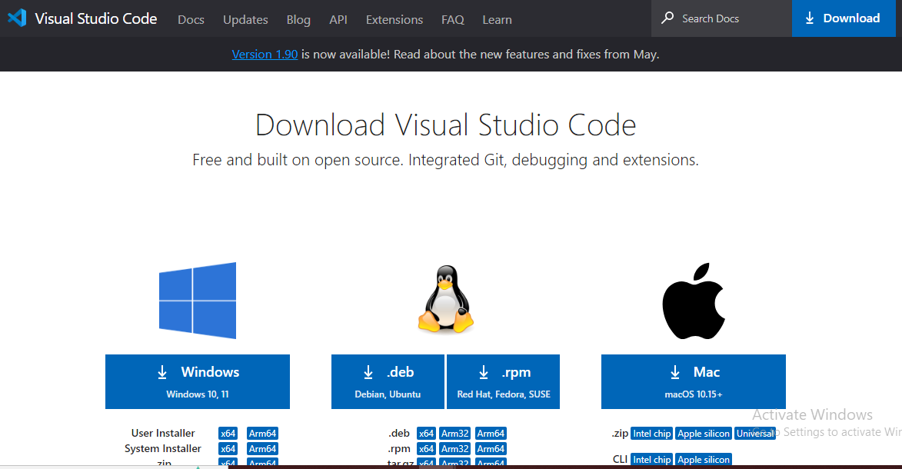
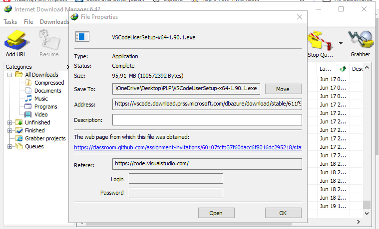
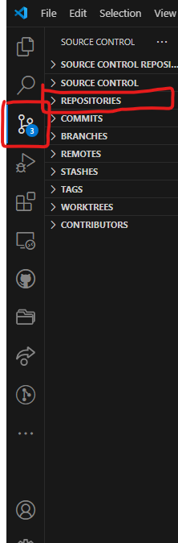

# SE-Assignment-5
Installation and Navigation of Visual Studio Code (VS Code)
 Instructions:
Answer the following questions based on your understanding of the installation and navigation of Visual Studio Code (VS Code). Provide detailed explanations and examples where appropriate.

 Questions:

Installation of VS Code:
1.  Describe the steps to download and install Visual Studio Code on Windows 11 operating system. Include any prerequisites that might be needed.  
   **Answer**  
   Prerequisites  
   - Firstly ensure that your system is running on a Windows 11 by clicking the windows icon on the keyboard and search aboutnyour pc . it is going to show which operating system you running on. 
   - Secondly You need a stable internet connection to download the installer.
   - Open your web browser and navigate to the Visual Studio Code website https://code.visualstudio.com/download.
   - Select and download Visual Studio Code of your operating system which is windows 11. 
   - Once the download is complete, open the downloaded file (usually named VSCodeSetup-x.x.x.exe where x.x.x is the   version number). 
   - If a User Account Control (UAC) prompt appears, click "Yes" to allow the installer to make changes to your device.
   - Accept the License Agreement:
   - The Visual Studio Code Setup wizard will open. Read the license agreement and, if you agree, select "I accept the agreement" and click "Next".
   - Choose the destination folder where you want to install VS Code. The default location is usually fine. Click "Next".
   - You can select additional tasks that you want the installer to perform, such as:
   - Creating a desktop icon, Adding "Open with Code" action to the context menu for Windows Explorer, Registering Code as an editor for supported file types,and Adding to the PATH environment variable.
   - Select the options you prefer and click "Next".
   - Click "Install" to begin the installation. The setup will copy the necessary files to your computer.
   - Once the installation is complete, you can choose to launch VS Code immediately by checking the "Launch Visual Studio Code" option and clicking "Finish".

2. First-time Setup:
After installing VS Code, what initial configurations and settings should be adjusted for an optimal coding environment? Mention any important settings or extensions.
   **Answers**  
   After installing Visual Studio Code (VS Code), there are several initial configurations and settings you can adjust to create an optimal coding environment. Here are some important settings and recommended extensions to consider:
   - If you didn't select to launch VS Code during the installation, you can open it by searching for "Visual Studio Code"  in the Start menu and clicking on the application.
__Initial Configurations and Settings__
   - Theme and Appearance:
   Color Theme: Choose a color theme that suits your preference. Go to File > Preferences > Color Theme or press Ctrl+K Ctrl+T to browse and select a theme.
   Icon Theme: Customize the file icons. Go to File > Preferences > File Icon Theme.
   Font and Editor Settings:

   - Font Size:  
   Adjust the font size for better readability. Go to File > Preferences > Settings and search for "font size". 
   Font Family: Choose a font that you find comfortable for coding. In the settings, search for "font family" and specify your preferred font.  
   
   - Line Numbers: Enable or customize line numbers by searching for "line numbers" in settings.
   Word Wrap: Enable word wrap for long lines by searching for "word wrap" in settings.
   - Auto Save:
   Enable auto save to automatically save your work. Go to File > Preferences > Settings, search for "auto save", and choose your preferred option (e.g., "afterDelay" or "onWindowChange"). 

3. User Interface Overview:
   - Explain the main components of the VS Code user interface. Identify and describe the purpose of the Activity Bar, Side Bar, Editor Group, and Status Bar.  
   **Answers**  
   1. **Activity Bar**
Purpose: The Activity Bar is located on the far left side of the VS Code window. It provides quick access to various views and panels within VS Code.
Components:
- Explorer: Allows navigation through your project files and folders.
- Search: Provides search functionality across your project.
- Source Control: Integrates with version control systems like Git, displaying changes and allowing you to commit, pull, and push changes.
- Run and Debug: Provides tools for running and debugging your applications.
- Extensions: Manages VS Code extensions, enabling you to install, enable/disable, and manage extensions.  

2. **Side Bar**  

Purpose: The Side Bar is adjacent to the Activity Bar and contains different views and panels that can be toggled based on your current task or workflow.
Components:
- Explorer: Shows the file and folder structure of your project, allowing you to navigate, open, and manipulate files.
- Search: Provides search functionality to find specific text within files or across your project.
- Source Control: Displays information about the current state of version control (e.g., Git), including file changes and commit history.
- Extensions: Lists installed extensions and allows you to search and install new ones from the Visual Studio Code Marketplace.
- Debugger: Provides debugging tools and information when you are debugging your code.
- Remote Explorer (if enabled): Allows you to connect to remote servers or containers for development.  

3. **Editor Group**
Purpose: The Editor Group occupies the central area of the VS Code window and consists of one or more editor tabs where you can open and edit files.
Components:
- Editor Tabs: Each tab represents an open file or editor. You can have multiple tabs open simultaneously, switching between them to edit different files.
- Split Editors: You can split the editor vertically or horizontally to view and edit multiple files side by side.
- View and Edit: Provides a rich editing experience with features like syntax highlighting, code completion (IntelliSense), and integrated terminal.  

4. **Status Bar**
Purpose: The Status Bar is located at the bottom of the VS Code window and provides information and quick actions related to the current workspace and editor.
Components:
- Selection Information: Shows the line and column number of the current cursor position and the total lines in the file.
- Language Mode: Displays the programming language mode of the currently opened file.
- Git Branch: Shows the current Git branch and provides shortcuts for Git operations.
- Notifications: Displays notifications and status messages, such as errors or warnings.
- Extensions: Shows the status of installed extensions and provides quick access to extension settings.  

4. Command Palette:
What is the Command Palette in VS Code, and how can it be accessed? Provide examples of common tasks that can be performed using the Command Palette.  
**Answers**  
   Accessing the Command Palette
To access the Command Palette in VS Code: Use this Keyboard Shortcut: Press Ctrl+Shift+P (Windows/Linux) or Cmd+Shift+P (Mac).
Menu: Click on View in the top menu bar, then select Command Palette....
Once open, the Command Palette displays a text input field where you can type commands or use fuzzy search to find specific actions. As you type, it dynamically filters and suggests matching commands and options.

Examples of Common Tasks Using Command Palette
**File and Workspace Management:**  
Open File: Type "Open File" or "File: Open" to quickly open a specific file in your project.
Save All: Type "Save All" to save all open files simultaneously.
Close Editor: Type "Close Editor" to close the active editor tab.  

**Version Control (Git):**
Git: Commit: Type "Git: Commit" to commit changes to your Git repository.
Git: Pull: Type "Git: Pull" to pull changes from a remote repository.
Git: Push: Type "Git: Push" to push committed changes to a remote repository. 

**Extensions:**
Extensions: Install Extensions: Type "Extensions: Install Extensions" to search and install new extensions from the VS Code Marketplace.
Extensions: Disable All Installed Extensions: Type "Extensions: Disable All Installed Extensions" to disable all installed extensions.  
 

**Debugging:**
Debug: Start Debugging: Type "Debug: Start Debugging" to begin debugging your application.
Debug: Stop Debugging: Type "Debug: Stop Debugging" to stop the current debugging session.

5. Extensions in VS Code:
   - Discuss the role of extensions in VS Code. How can users find, install, and manage extensions? Provide examples of essential extensions for web development.  
   **Answer**  
   Extensions in Visual Studio Code (VS Code) play a crucial role in extending its functionality and customizing the editor to suit specific programming languages, frameworks, and development workflows. They enhance productivity by providing additional features, tools, and integrations that are not included in the core editor by default.  
**Role of Extensions in VS Code**
- **Functionality Extension:** Extensions add new capabilities to VS Code, such as language support, debugging tools, code formatting, and integration with version control systems.
- **Customization:** Users can customize their coding environment by installing extensions that modify the editor's appearance, behavior, and functionality to align with their preferences and workflow.
- **Integration:** Extensions enable integration with external services, APIs, and tools, allowing seamless development across different platforms and environments.

**Finding Extensions:**
Extensions View: Click on the Extensions icon in the Activity Bar (or use the shortcut Ctrl+Shift+X) to open the Extensions view. Here, you can browse, search, and discover extensions.

6. Integrated Terminal:
   - Describe how to open and use the integrated terminal in VS Code. What are the advantages of using the integrated terminal compared to an external terminal?  
   **Answer**
   **To open the integrated terminal in VS Code:**
   - Using the Menu:
Click on View in the top menu bar - Select Terminal > New Terminal.
Using Keyboard Shortcut:
Press Ctrl+ ` (backtick/grave accent) on Windows/Linux.
Press Cmd+ ` (backtick/grave accent) on macOS.  

**Advantages of Using the Integrated Terminal**
- Seamless Integration: No need to switch between VS Code and an external terminal window, reducing context switching and improving focus on coding tasks.
- Workspace Awareness: Automatically opens in the context of your project's directory, making it easier to run commands and manage files related to your current workspace.
- Consistent Environment: Ensures that the terminal environment (e.g., shell type, settings) matches the VS Code environment, reducing compatibility issues and configuration discrepancies.
- Accessibility: Available across different operating systems (Windows, macOS, Linux) within VS Code, maintaining a consistent user experience regardless of the development platform.
- Enhanced Productivity: Streamlines development workflows by providing quick access to command-line tools and utilities without leaving the editor, thus saving time and effort.

7. File and Folder Management:
   - Explain how to create, open, and manage files and folders in VS Code. How can users navigate between different files and directories efficiently?  
   Creating Files and Folders
- New File: Click the Explorer icon or press Ctrl+Shift+E.
- Opening Files and Folders
- Click File > Open File... and select the file.
- Press Ctrl+P, type the file name, and select it.
- Managing Files and Folders: Move:Drag and drop within the Explorer pane.  
- Rename:Right-click, select Rename, and enter the new name.
- Delete: Right-click and select Delete.
- Explorer Pane: Click files to open them.
- Quick Open: Press Ctrl+P, type the file name, and select it.
- Breadcrumbs: Click parts of the file path at the top of the editor.
- Split Editor:
- Right-click a tab and select Split Right or Split Down.

8. Settings and Preferences:
   - Where can users find and customize settings in VS Code? Provide examples of how to change the theme, font size, and keybindings.  
   **Answers**  
   **Settings:** Access settings by clicking the gear icon or pressing Ctrl+,.
**Change Theme:** Use Ctrl+Shift+P, type Preferences: Color Theme, and select a theme.
**Change Font Size:** Search for font size in Settings and adjust Editor: Font Size.
**Change Keybindings:** Use Ctrl+K Ctrl+S to open Keyboard Shortcuts, search for commands, and set new key combinations.

9. Debugging in VS Code:
Outline the steps to set up and start debugging a simple program in VS Code. What are some key debugging features available in VS Code?  
**Answers**  
**Here's a step-by-step guide to set up and start debugging a simple program in VS Code:**

Open Your Project:
Open the folder containing your project files in VS Code (File > Open Folder...).
Install Debugging Extension (if needed):
For most languages, you'll need to install a specific extension to enable debugging. For example, for Python, you need the Python extension.
Go to the Extensions view (Ctrl+Shift+X), search for the language extension (e.g., "Python"), and install it.  

Open the Debug View: Click the Debug icon in the Activity Bar on the side or press Ctrl+Shift+D.

10. Using Source Control:
    - How can users integrate Git with VS Code for version control? Describe the process of initializing a repository, making commits, and pushing changes to GitHub.  
    **Answers**  
    First Install Git and VS Code
- Install Git: Download and install Git from git-scm.com  
- Set Up Git in VS Code
- Open VS Code.
Open the Command Palette by pressing Ctrl+Shift+P (Windows/Linux) or Cmd+Shift+P (Mac).
Type Git: Clone and select it. 
Enter the repository URL (if you are cloning an existing repository) or skip this step if you are initializing a new repository.
   - Initialize a Git Repository
Open a folder in VS Code that you want to turn into a Git repository.
Click on the Source Control icon on the left sidebar (or press Ctrl+Shift+G). 
Click on Initialize Repository button.
   - Make Changes and Commit
Edit Files: Make changes to your files using the VS Code editor.
Stage Changes:
Go to the Source Control view.
You will see a list of changed files. Click the + icon next to each file to stage it, or click + next to Changes to stage all changes.
Commit Changes:
Type a commit message in the message box.
Click the checkmark icon (✔️) to commit the staged changes.
   - Connect to GitHub
Open Command Palette by pressing Ctrl+Shift+P (Windows/Linux) or Cmd+Shift+P (Mac).
Type Git: Add Remote and select it.
Enter the name origin (or any other name you prefer).
Enter the GitHub repository URL (e.g., https://github.com/yourusername/your-repo.git).
   - Push Changes to GitHub
Open Terminal in VS Code by selecting View > Terminal or pressing `Ctrl+``.
Run the following commands:
bash
Copy code
git push -u origin master
This will push your changes to the master branch on GitHub.

 Submission Guidelines:
- Your answers should be well-structured, concise, and to the point.
- Provide screenshots or step-by-step instructions where applicable.
- Cite any references or sources you use in your answers.
- Submit your completed assignment by 1st July 

